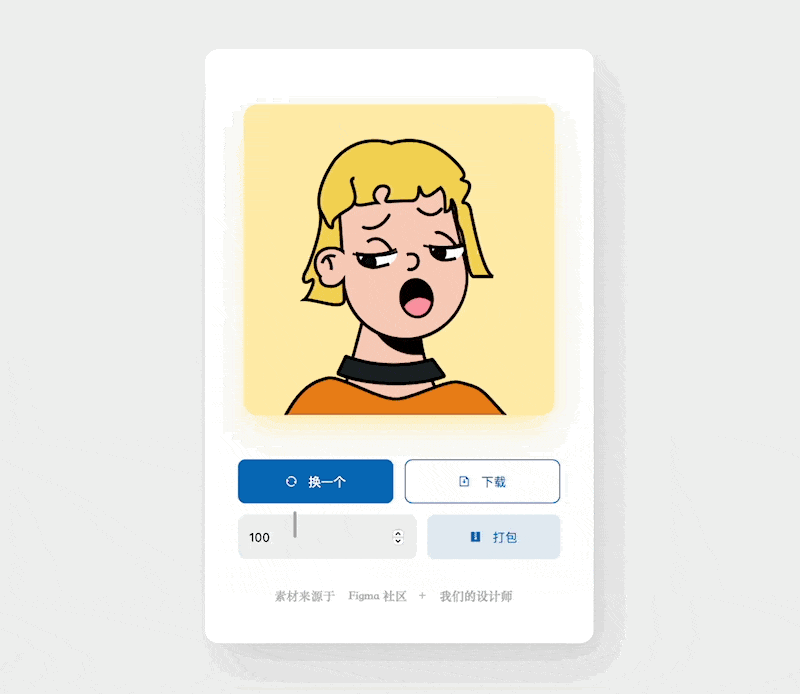

简体中文 | [English](./README-EN.md)

  

# 头像生成器

## 简介

一个纯前端实现的头像生成器，并且支持导出与批量下载的功能;

在线演示： [https://avatar.gaoxiazhitu.com](https://avatar.gaoxiazhitu.com)

预览：



## 运行项目

> 该项目基于 `vue@2.x` 构建， 运行前，请确保您已安装了 `node` 环境

1. 克隆项目

```bash
git clone https://github.com/wave-charts/avatar-gen.git
cd chart-gen
```

2. 运行项目

**通过 Yarn 运行项目**

```bash
yarn
yarn serve
```

**通过 npm 运行项目**

```bash
npm install
npm run serve
```

## 定制

> 项目的头像相关素材来自 Figma 社区：[https://www.figma.com/community/file/829741575478342595/Avatar-Illustration-System](https://www.figma.com/community/file/829741575478342595/Avatar-Illustration-System)

头像由不同的图层构成，图层的配置位于 : `src/views/avatar.config.ts`,
在文件中定义了 `avatarConfig`：

```ts
export const avatarConfig: Record<LayerType, LayerConfig[]> = {
  // 头
  Base: [
    {
      id: 1,  // 素材文件夹下的文件名， eg: `src/views/resource/Base/1.vue`
      colorLib: colorLib.skin,  // 可用颜色的集合
      weight: 5,  // 权重，影响出现的概率
    },
  ],

  // 耳朵
  Ear: [
    {
      id: 1,  // eg: `src/views/resource/Ear/1.vue`
      colorRefer: "Base", // 设置颜色跟随， eg: Ear 的颜色跟随 Base (即耳朵的颜色和头保持一致)
      weight: 1,
    },
    {
      id: 2,  // eg: `src/views/resource/Ear/2.vue`
      colorRefer: "Base",
      weight: 1,
    },
  ],

  ...
};
```
